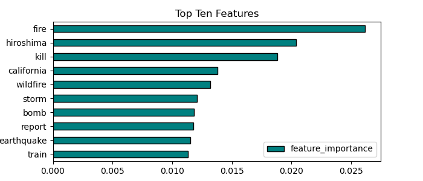

# Tweet Predictor

The problem at hand is to develop a robust classification model that can accurately differentiate between real and fake disaster-related tweets. With the rise of social media usage during times of crisis, the spread of misinformation and fake news has become a growing concern. This can lead to confusion, panic, and even impede emergency response efforts. Therefore, it is crucial to develop a machine learning-based solution that can identify and filter out fake disaster tweets from real ones. The classification model should be able to handle large volumes of data, account for variations in language, and be able to generalize to different types of disasters. The solution will be beneficial to emergency responders, news agencies, and the public in making informed decisions during a crisis.

Dataset Description
This dataset contains tweets related to disasters and their classification as real or fake. The dataset has two parts: a training set and a test set. The training set contains 7503 rows, while the test set contains 3243 rows.

Each row in the dataset has the following columns:

- id: A unique identifier for each tweet
- text: The text of the tweet
- location: The location the tweet was sent from (may be blank)
- keyword: A particular keyword from the tweet (may be blank)
- target: In train.csv only, this denotes whether a tweet is about a real disaster (1) or not (0)
The aim of this dataset is to predict whether a tweet is about a real disaster or not. This is a classification task.

Dataset Source
This dataset is sourced from Kaggle, and can be found at the following link: https://www.kaggle.com/c/nlp-getting-started/data

Data Preprocessing
Before using this dataset for machine learning models, it may require some preprocessing. For example, the location and keyword columns may require cleaning and normalization. Additionally, the text column may require preprocessing steps such as tokenization, stemming, and stopword removal.

Model Building
The goal of this dataset is to build a machine learning model to predict whether a tweet is about a real disaster or not. Various classification algorithms can be used, such as logistic regression, Naive Bayes Classifier, Random Forest Classifier. Hyperparameter tuning is performed using techniques like Gridsearch and Randomsearch. Additionally, natural language processing techniques can be used to extract features from the text column. The accuracy of the model can be evaluated using metrics such as precision, recall, and F1-score.

### Conclusion

#### The kaggle dataset was loaded and cleaned using Regular Expressions, lemmatization. The data was analyzed by calculating the text length, word lengths and visualizing the columns. The average text length was around 100 and average word count was around 15. Data was then divided into two separate datasets based on the target column to analyze and visualize frequent words in real and fake tweets. It appears that similar words have been used in both real disaster tweets and fake tweets. Data was then modeled using NLP techniques like TFIDF vectorizer and Countervectorizer and various Supervised learning models starting with a simple logistic regression, Naive Bayes Classifier, Random Forest, XGBoost Classifier and ended with regularizing a logistic regression model. Models were trained and tested with 70% training and 30% testing data. Models were rigorously evaluated with metrics like accuracy, precision, recall, specificity. AUC curves were plotted, hyperparameter tuning was performed on models like Randomforest and XGBoost. Confusion matrix was plotted for every model, increased and decreased thresholds to see how the model performed at different thresholds. 

####  This model not only helps in flagging fake tweets, it is also helpful to identify real tweets and assist people who are in need of help. Once a model is deployed into production and providing utility to the business, it is necessary to monitor how well the model is performing to implement something that will continuously update the database as new data is generated. We can use a scalable messaging platform like Kafka to send newly acquired data to a long running Spark Streaming process. The Spark process can then make a new prediction based on the new data and update the operational database. 

#### Most of the models had an accuracy of about 80% on test score, however, because of the similarity of the words used in both real and fake tweets more data is required for our Machine learning models to classify these tweets with high accuracy

